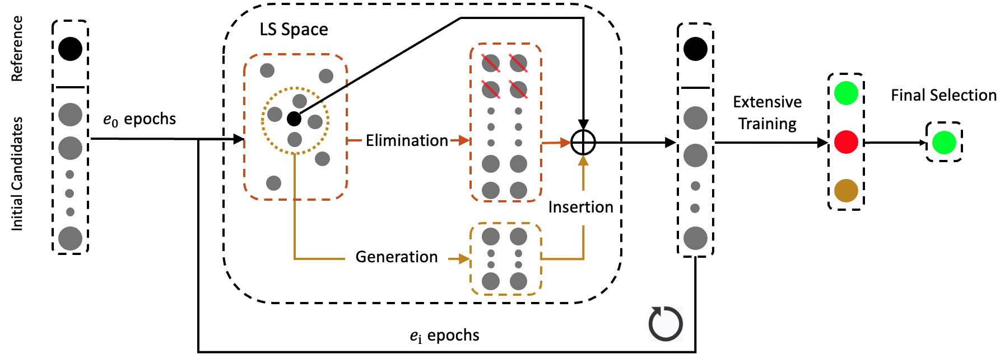

# Hyperpruning

This repository is the official implementation of Hyperpruning: 

Hyperpruning first generates an initial candidate pool based on hyperparameter optimization algorithms (HPO) with LS-based or loss-based metric. It then iteratively excludes candidates based on LS distance or loss. Remaining candidates are extensively trained until their accuracies converge.




## System Requirements
Our code is run on Ubuntu 20.04. No non-standard hardware is required.

## Installation Guide
### requirement
- Python 3.8
- Pytorch 1.11.0
- Additional requirements in requirements.txt
  - ```bash
    conda create --name hyperpruning python=3.8
    # installation could take a couple minutes
    pip install -r requirements.txt
    
## Selecting the optimal candidate
  Following is the code for Stacked-LSTM
  ````
  python hyperpruning.py --ind 100 --max_evals 40 --LE_based 'True' -e0 3 -ei 3 --hp_opt 'tpe'
  ````
Options:
* --ind: it is for tracking different experiments and does not have any impact on the experiment results
* --max_evals: it is the number of candidates in the initial pool, --hp_opt defines the HPO
* --LS_based: if 'True', it uses LS distance as the metric, otherwise uses current loss
* --e0: the number of epochs for the first round
* --e1: the number of epochs for future rounds
* --hp_opt: it decides which hyperparameter optimization algorithms (HPO) to use ('tpe', 'atpe')
* --initial_pool: if 'True', it will load the existing initial pool and run hyperpruning, otherwise, create a new initial pool
* --evaluate: string of the model path

## Evaluating Selected Candidate

You can download the example initial candidate pool here: 
* [Initial candidates pool of stacked-LSTM trained on PTB](https://drive.google.com/file/d/1Xv541T50amL8crY2nzG2AcqaVnCtn6mC/view?usp=sharing).

and run the following command to finish the hyperpruning process:
  ````
  python hyperpruning.py -ind 100 --max_evals 40 --LE_based 'True' --hp_opt 'tpe' --initial_pool 'True'
  ````

You can also download the pretrained selected Selfish stacked-LSTM models here:
* [Selected stacked-LSTM trained on PTB](https://drive.google.com/file/d/1ydFMSUKuT3oI1G3JC7DyXncJED5AOzkQ/view?usp=sharing).

and evaluate it using the following command:
  ````
  python hyperpruning.py --evaluete 'file_path'
  ````
This methodological hyperparameter of this model is:
* Sparse Initialization: ER
* Growth: Random
* Death: Global Magnitude
* Redistribution: nonzeros
* Death rate: 0.7

gives **69.73** test perplexity and **72.27** validate perplexity on PTB dataset at sparsity of **0.67**.

## Apply Hyperpruning to your own architectures
Hyperpruning algorithm can be easily adapted to your own architecture within three steps:

(1) Calculate the Jacobian matrix of your architecture and update the sources/lyapunov.py

(2) Partially train a full dense model, and calculate LS at each epoch

(3) Run the hyperpruning.py